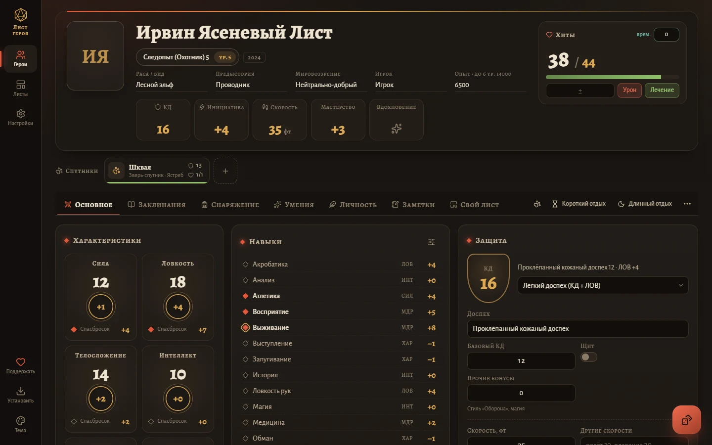
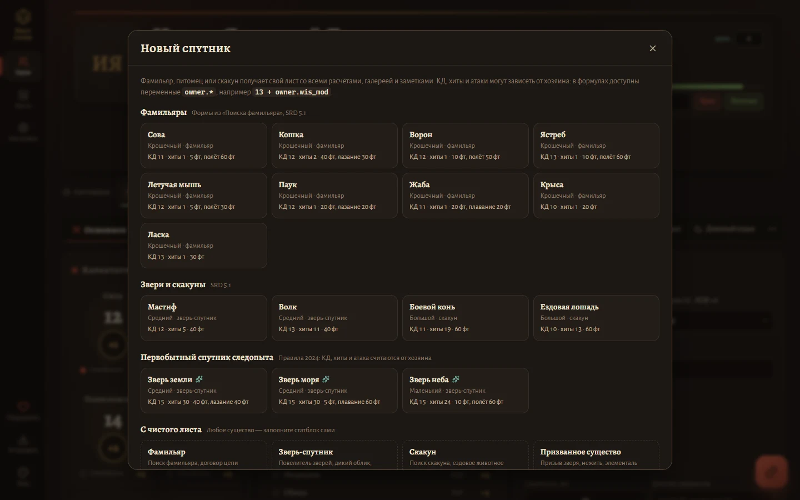
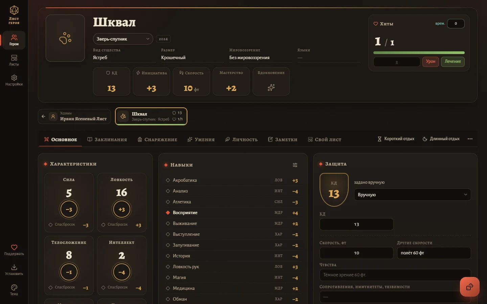
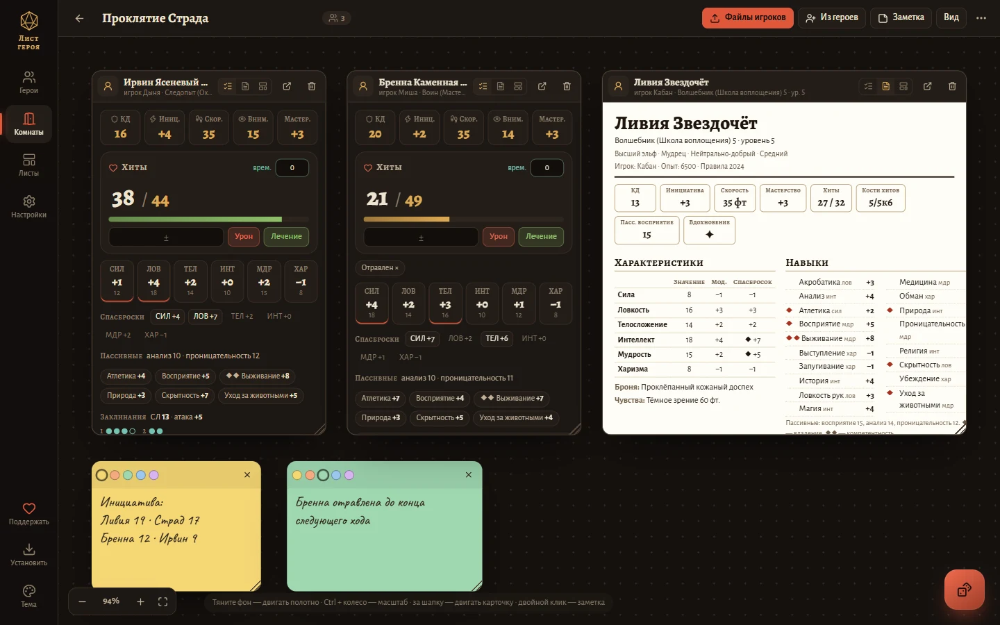
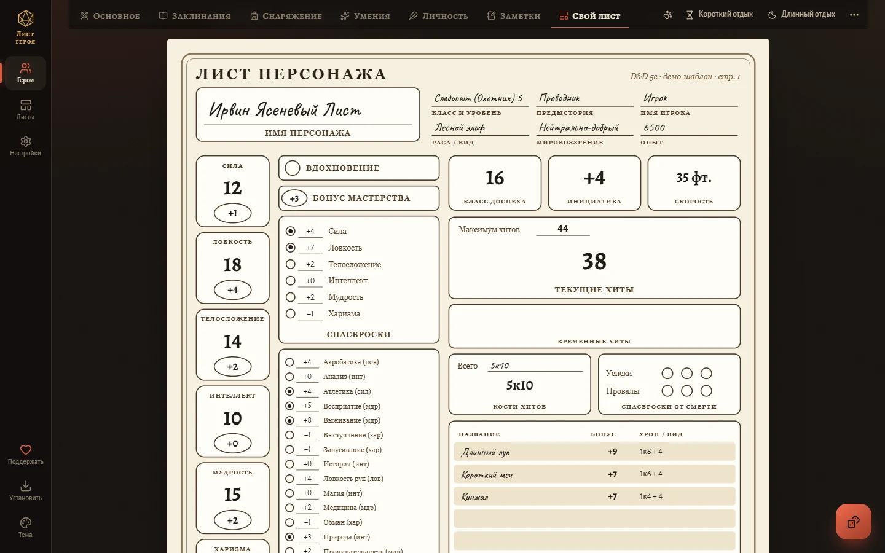
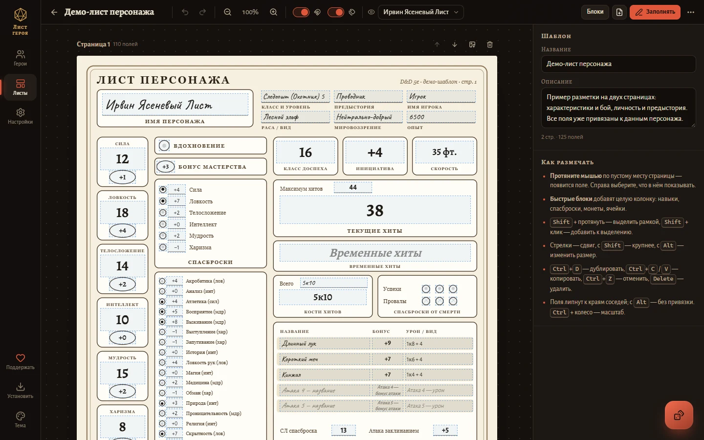
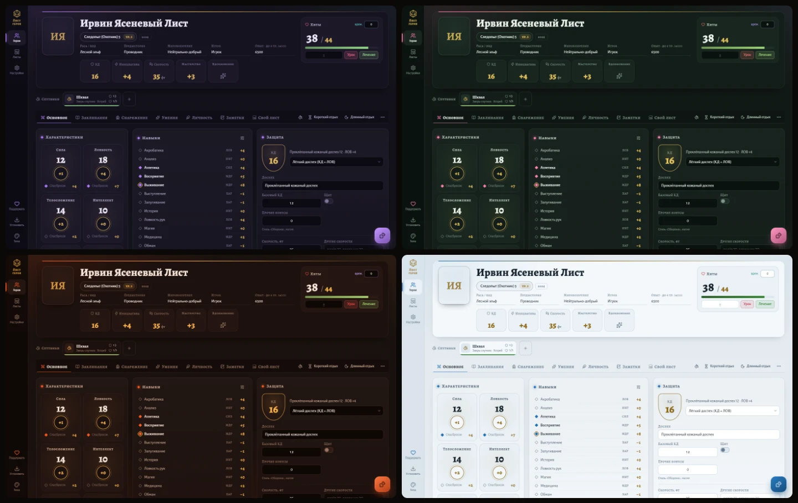
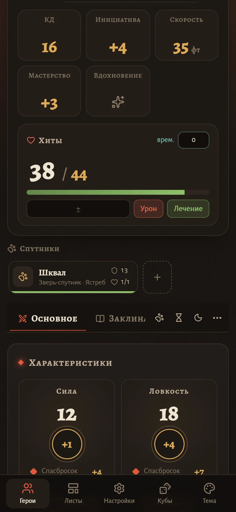

<div align="center">


# Лист героя

**Лист персонажа D&D 5e, который считает сам.**<br />
Правила 2014 и 2024 · свои листы из картинки или PDF · комнаты для мастера · спутники · кубы · работает без интернета

### [▶ Открыть лист героя](https://watithemint.github.io/dnd-sheet/)

Бесплатно, без регистрации и рекламы. Персонажи хранятся только в вашем браузере.



</div>

## Что умеет

### 🧮 Считает всё сам

Вы вводите значения характеристик, классы и снаряжение. Остальное лист пересчитывает при каждом изменении:

- модификаторы, спасброски, навыки (владение, компетентность, «Мастер на все руки»), пассивные проверки, инициативу и бонус мастерства;
- КД в любом режиме: без доспеха, лёгкий, средний и тяжёлый доспех, природная броня, защита варвара или монаха, своя формула, щит и бонусы;
- максимум хитов по костям хитов, в том числе при мультиклассе. Урон сначала списывает временные хиты;
- СЛ и бонус атаки заклинаниями, ячейки для любых заклинателей и магию договора. Кнопка «Сотворить» сама тратит ячейку;
- бонус атаки и урон оружия, нагрузку, заряды умений по формулам (`prof`, `max(1, cha_mod)`);
- истощение по правилам выбранной редакции.

Короткий и длинный отдых восстанавливают то, что положено. Клик по любому бонусу бросает кубы, для преимущества и помехи зажмите Shift или Alt.

### 🐾 Спутники — фамильяры, питомцы, скакуны



У героя может быть сколько угодно спутников. Каждый — отдельный полноценный лист со своими атаками, умениями, снаряжением, заметками и галереей. Спутники видны прямо под шапкой листа хозяина: имя, КД и хиты. Одним кликом можно открыть лист спутника и так же быстро вернуться к хозяину.

- **Готовые статблоки:** сова, кошка, ворон, ястреб, летучая мышь, паук, жаба, крыса, ласка, мастиф, волк, боевой конь и ездовая лошадь (SRD 5.1).
- **Первобытный спутник следопыта (2024):** зверь земли, моря и неба. КД, хиты и атака считаются от хозяина и растут вместе с его уровнем.
- **С чистого листа:** призванное существо, помощник, конструкт — любой статблок.
- В формулах спутника доступны переменные хозяина: `13 + owner.wis_mod`, `5 + 5 * owner.ranger_level`. Бонус мастерства можно брать у хозяина.
- Спутники экспортируются, копируются, печатаются и удаляются вместе с героем.



### 🚪 Комнаты игроков — для мастера



Полотно, на котором лежат листы всей партии. Мастер видит сразу у всех хиты, КД, спасброски, ячейки и состояния — и может бросить за любого игрока прямо с карточки.

- **Импорт всей партии за раз:** игроки присылают свои файлы («⋯» → «Экспорт в JSON»), мастер перетаскивает их на полотно. Подойдут и экспорты Long Story Short.
- **Повторный импорт обновляет лист.** Игрок прислал свежий файл после сессии — его карточка обновится, а не появится второй раз.
- **Карточки можно двигать, растягивать и переключать:** кратко (всё главное для боя), весь лист целиком или ваш собственный лист из «Листов».
- **Заметки-стикеры** для инициативы, напоминаний и сюжетных зацепок. Двойной клик по полотну — новая заметка.
- Полотно двигается мышью, пальцем или колесом, масштаб — Ctrl + колесо или щипком. «Упорядочить» раскладывает карточки ровными рядами.
- На полотно можно положить и своих героев из «Героев». Персонажи игроков живут в комнате и не смешиваются с вашими.
- Комнату целиком можно выгрузить в файл и открыть на другом устройстве, например на планшете за столом.
- **Живая комната:** «Пригласить» → ссылка в чат группы. Игроки открывают её, выбирают героя — и дальше каждое изменение на их листе через секунду видно мастеру, а на карточке горит «в сети». Нужна одноразовая настройка Firebase — см. [ниже](#живые-комнаты-настройка-firebase).

### 📜 Свои листы



Загрузите картинку или PDF любимого листа — официального, фанатского или нарисованного своими руками. Расставьте на нём поля, и он заполнится данными героя со всеми расчётами.

- PNG, JPG, SVG и многостраничные PDF. В заполняемых PDF поля формы находятся и привязываются сами.
- Любое из ~300 значений листа, своё поле (текст, число, флажок, абзац), формула или надпись.
- Прилипание к соседним полям, выделение рамкой, выравнивание, готовые блоки (навыки, спасброски, монеты, ячейки), отмена и повтор. Горячие клавиши работают и в русской раскладке.
- Текст, который не помещается, сам уменьшается. Клик по модификатору на листе бросает кубы.
- Шаблон вместе с картинками выгружается в один файл — его можно отдать всей группе.



### 🎨 Семь тем



**Таверна** и **Пергамент**, **Подземье** с фиолетовой тьмой и светящимися грибами, сумеречная **Страна Фей**, раскалённый **Авернус**, выцветшее **Царство Теней** и снежная **Долина Ледяного Ветра**. Тема переключается кнопкой «Тема» в меню, а в настройках каждая тема показана своими цветами. Можно выбрать «Как в системе» — тогда днём будет Пергамент, а ночью Таверна.

### 🖼️ Галерея

Сколько угодно картинок у каждого героя и спутника: арты, карты, жетоны, рисунки игроков. Картинки можно перетащить из папки, подписать и упорядочить. Просмотр — на весь экран, листать можно стрелками или свайпом. Любую картинку можно сделать портретом. Галерея попадает в печать и в экспорт.

### 🔗 Ссылки на источники

- У атак, заклинаний, предметов и умений есть поле ссылки и кнопка «Найти на dnd.su / ttg.club / D&D Beyond».
- В текстах ссылку можно поставить на любой фрагмент.
- У каждого героя есть раздел «Источники и ссылки». Поисковые сайты настраиваются.

### 📱 И ещё

- **Печать и PDF:** весь лист целиком — личность, предыстория, галерея и статблоки спутников. Ссылки в PDF остаются кликабельными.
- **Импорт из Long Story Short:** перетащите JSON-экспорт на страницу «Герои».
- **Работает без интернета.** Сайт можно установить как приложение на телефон или компьютер.
- **Резервная копия** всех героев и листов одним файлом. Сайт напоминает о ней раз в две недели.
- **Удалённое можно вернуть:** атаки, заклинания, предметы и картинки восстанавливаются кнопкой в уведомлении.
- **Удобен на телефоне:** лист подстраивается под экран.
- **Пасхалки.** Где-то на сайте спрятаны секреты, один из них открывает тайную тему. Счётчик находок — в «Настройках».

<p align="center"></p>

## Как начать

1. Откройте **[watithemint.github.io/dnd-sheet](https://watithemint.github.io/dnd-sheet/)**.
2. Нажмите «Новый герой» или «Пример героя», чтобы посмотреть готовый лист со спутником.
   Мастеру — «Комнаты» → «Новая комната», и перетащите туда файлы игроков.
3. Чтобы пользоваться без интернета, установите приложение:
   - на компьютере — кнопка «Установить» в меню сайта;
   - на Android — «Добавить на главный экран»;
   - на iPhone — «Поделиться» → «На экран „Домой“».

## Где хранятся данные

Все персонажи, листы и картинки лежат **только в вашем браузере**, на сервер ничего не отправляется. Поэтому:

- на другом устройстве героев не будет — перенесите их через «Настройки» → «Резервная копия»;
- очистка данных сайта в браузере удалит и героев. Раз в пару недель скачивайте резервную копию, это один файл;
- обновления сайта персонажей не трогают.

## Формулы

Формулы работают в КД, максимуме хитов, зарядах умений и полях своих листов.

| Переменные | Что это |
|---|---|
| `level`, `prof` | уровень, бонус мастерства |
| `str`, `dex`… · `str_mod`… · `str_save`… | значение, модификатор и спасбросок характеристики |
| `perception`, `stealth`, `sleightOfHand`… | итоговые бонусы навыков |
| `ac`, `initiative`, `speed`, `hp`, `hp_max`, `hp_temp` | бой |
| `spell_dc`, `spell_attack`, `spell_mod`, `caster_level` | заклинания |
| `ranger_level`, `wizard_level`… | уровень в конкретном классе |
| `owner.…` | у спутника — любая переменная хозяина: `owner.wis_mod`, `owner.ranger_level` |
| `c.ключ` | числовое «своё поле» шаблона |

Функции: `floor ceil round min max abs clamp(x, a, b) if(условие, да, нет)`. Операторы: `+ - * / % > < >= <= == != && || ?:`.

## Поддержать проект

Лист героя бесплатный и без рекламы. Если он пригодился вашей группе, автора можно угостить чашкой кофе на **[Ko-fi](https://ko-fi.com/wati_mint)** ☕

Нашли ошибку или есть идея — напишите в [Issues](https://github.com/watithemint/dnd-sheet/issues).

## Для разработчиков

React 19, TypeScript, Vite, zustand, IndexedDB, TipTap, pdf.js. Сервера нет — это статический сайт.

```bash
npm install
npm run dev        # http://localhost:5173
npm test           # автотесты расчётов, импорта и печати
npm run build      # готовый сайт в dist/
```

**Публикация на GitHub Pages.** Загрузите в репозиторий **содержимое** папки `dist/` — `index.html` должен лежать в корне. Затем Settings → Pages → «Deploy from a branch», `main`, `/ (root)`. При обновлении загрузите новые файлы поверх старых. Посетители увидят плашку «Вышла новая версия» и обновятся одной кнопкой, персонажи сохранятся.

**Кнопка «Поддержать»** настраивается в `config.json` в корне сайта, без пересборки. Разрешены только ссылки `https://`.

### Живые комнаты: настройка Firebase

Синхронизации нужен посредник между браузерами — бесплатная база Firebase Realtime Database от Google. Настраивается один раз, пересобирать сайт не нужно.

1. Откройте [console.firebase.google.com](https://console.firebase.google.com), войдите в Google-аккаунт и нажмите **«Создать проект»**. Название любое, например `dnd-sheet`. Google Analytics можно выключить.
2. Слева **Build → Realtime Database → Create Database**. Расположение — **Belgium (europe-west1)**, режим — **Start in locked mode**.
3. На вкладке **Rules** замените всё содержимое правилами ниже и нажмите **Publish**.
4. **Build → Authentication → Get started → Sign-in method → Anonymous → Enable → Save**. Там же, на вкладке **Settings → Authorized domains**, добавьте `watithemint.github.io` (или свой домен).
5. Шестерёнка у «Project Overview» → **Project settings → General → Your apps →** значок **`</>`** (Web). Название любое, Firebase Hosting не нужен → **Register app**. Появится блок `firebaseConfig`.
6. Скопируйте из него `apiKey`, `authDomain`, `databaseURL`, `projectId`, `appId` в раздел `sync.firebase` файла `config.json` в репозитории и сохраните. Через пару минут в комнатах заработает «Пригласить».

Эти настройки не секретные — их видит браузер каждого посетителя. Защищают данные правила: игрок может писать только свой лист, мастер — только свою комнату, а без кода комнаты ничего не прочитать.

```json
{
  "rules": {
    "rooms": {
      "$code": {
        ".read": "auth != null && $code.length >= 10",
        ".write": "auth != null && data.child('meta/gm').val() === auth.uid && !newData.exists()",
        "meta": {
          ".write": "auth != null && (!data.exists() || data.child('gm').val() === auth.uid)",
          ".validate": "newData.child('gm').val() === auth.uid && newData.child('name').isString() && newData.child('name').val().length <= 200"
        },
        "players": {
          "$uid": {
            ".write": "auth != null && (auth.uid === $uid || root.child('rooms/' + $code + '/meta/gm').val() === auth.uid)",
            "$hero": {
              ".validate": "root.child('rooms/' + $code + '/meta').exists() && newData.child('character').isString() && newData.child('character').val().length < 400000 && newData.child('companions').isString() && newData.child('companions').val().length < 400000 && newData.child('portrait').isString() && newData.child('portrait').val().length < 60000"
            }
          }
        },
        "presence": {
          "$uid": {
            ".write": "auth != null && auth.uid === $uid"
          }
        },
        "$other": { ".validate": false }
      }
    }
  }
}
```

Бесплатного тарифа Spark хватает с большим запасом: лист героя без картинок весит десятки килобайт. Картинки галереи в облако не отправляются, портрет — только маленькой копией.

```
src/
  lib/          расчёты, формулы, кубы, импорт LSS, PDF, экспорт
  data/         правила 5e, статблоки спутников, темы, привязки полей
  store/        состояние (zustand + IndexedDB)
  components/   общие компоненты, редактор текста, кубы
  features/     страницы: герои, лист, спутники, галерея, комнаты, шаблоны, настройки
  styles/       CSS по разделам, темы — в tokens.css
```

## Правовое

Неофициальный фанатский инструмент, не связан с Wizards of the Coast. Dungeons & Dragons — товарный знак Wizards of the Coast LLC.

Статблоки фамильяров и зверей взяты из System Reference Document 5.1 («SRD 5.1») Wizards of the Coast LLC ([dnd.wizards.com/resources/systems-reference-document](https://dnd.wizards.com/resources/systems-reference-document)). SRD 5.1 распространяется по лицензии [Creative Commons Attribution 4.0 International](https://creativecommons.org/licenses/by/4.0/legalcode).

Шрифты Alegreya и Caveat — SIL Open Font License, иконки — [Lucide](https://lucide.dev) (ISC).

---

<sub>🇬🇧 **Hero Sheet** is a free, offline-first D&D 5e character sheet (2014 and 2024 rules) in Russian. It calculates everything automatically, lets you place fields on your own sheet images or PDFs, and supports companions (familiars, pets, steeds) with formulas based on their owner. Game masters get player rooms: a canvas with the whole party's sheets that can be imported in one go and updated from fresh exports. It also has seven themes, an image gallery, dice, and import from Long Story Short. All data stays in your browser.</sub>
